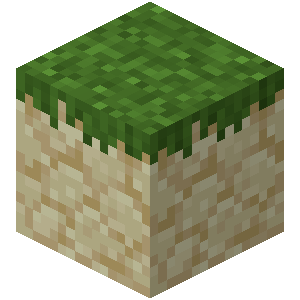

<div align="center"></div>

# Sandstone Resourcepacks


Sandstone Resourcepacks is an unofficial library for [Sandstone]. It allows
generation, modification and merging of Minecraft resource packs.

[Sandstone]: https://github.com/TheMrZZ/sandstone

## Features

This library is work in progress and requires Sandstone alpha.

- Models
  - [x] Create
  - [x] Edit
  - [x] Load
- Translations
  - [x] Type support
- Fonts
  - [ ] Work in progress
- Textures
  - [ ] Work in progress

### Strictly-typed vector math

This library includes a small but type-strong vector math library. Here are
some examples:

```ts
const v1 = vec3(5, 5, 4);
const v2 = vec3([1, 0, 1]);
const v3 = v1.mul(v2); // returns Vector(5, 0, 4)

const len = v3.length; // returns Math.sqrt(41)
const dot = v1.dot(v2); // returns 9

// Any dimensions of a vector supported
const uvxy = vecN<6>(0, 0, 16, 16, 0, 0)
    .add(1, 1, -1, -1, 10, 10)
    .mul(0.5);

uv.add(v1); // Error! (incompatible dimensions)

const constVec = new Vector(5, 5, 4);
// Typescript knows the exact value of this vector and computes the exact result
// of this function as a type
const rel: VectorClass<["~5", "~5", "~4"]> = constVec.toCoordsRel();
```